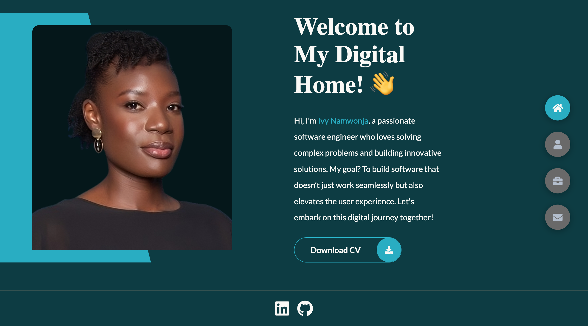

# Portfolio Website



Welcome to my portfolio website! This is a personal portfolio showcasing my work and skills in software engineering. The website includes various sections such as Home, About, Projects, and Contact. It is designed to be responsive and works well on both desktop and mobile devices.

## Table of Contents


- [Portfolio Website](#portfolio-website)
  - [Table of Contents](#table-of-contents)
  - [Features](#features)
  - [Getting Started](#getting-started)
  - [Folder Structure](#folder-structure)
  - [Technologies Used](#technologies-used)
  - [License](#license)
  - [Author](#author)

## Features

- **Responsive Design**: The website is optimized for both desktop and mobile views.
- **Mobile Navigation**: The website includes a mobile-friendly navigation menu that can be toggled using a hamburger icon.
- **Desktop Navigation**: The website features a desktop navigation bar with buttons that allow easy navigation between different sections (Home, About, Projects, Contact).
- **Smooth Scrolling**: Navigation links scroll smoothly to the desired sections.
- **Showcase of Skills**: Displays my skills and projects.
- **Contact Form**: Allows visitors to get in touch with me directly.

## Getting Started

To run and use the website:

1. **Clone the repository**: Clone the repository to your local machine.

    ```shell
    git clone https://github.com/istacyn/portfolio.git
    ```

2. **Navigate to the project directory**: 

    ```shell
    cd portfolio
    ```

3. **Open the HTML file**: Open the `index.html` file in a web browser to view the website.

## Folder Structure

The project structure is as follows:

- **styles/**: Contains the CSS files for styling the website.
- **js/**: Contains the JavaScript files for interactivity and dynamic behavior.
- **images/**: Contains the image files used in the website.
- **index.html**: The main HTML file for the website.
- **README.md**: This file, providing an overview of the project.

## Technologies Used

- **HTML5**: Structure of the website.
- **CSS3**: Styling and responsive design.
- **JavaScript**: Interactivity and dynamic behavior.
- **Font Awesome**: Icons used throughout the website.
- **Google Fonts**: Custom fonts for styling.

## License

The code in this repository is released under the [MIT License](LICENSE.md), which grants you the freedom to use, modify, and distribute the template as your own. However, if you choose to use the site's design largely unmodified, kindly credit me as the original designer of the site.

All projects and experiences included in this portfolio are the result of my own efforts and creativity. Please refrain from presenting them as your own.


## Author

This portfolio website was created by Ivy Namwonja, a software engineer. You can connect with me on [LinkedIn](https://www.linkedin.com/in/ivy-namwonja/).